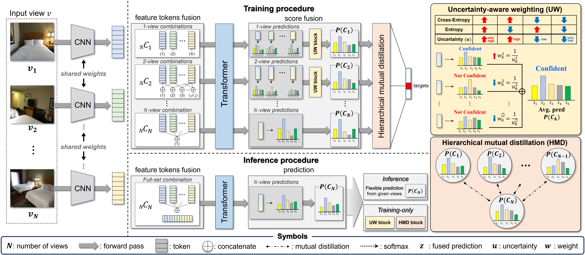
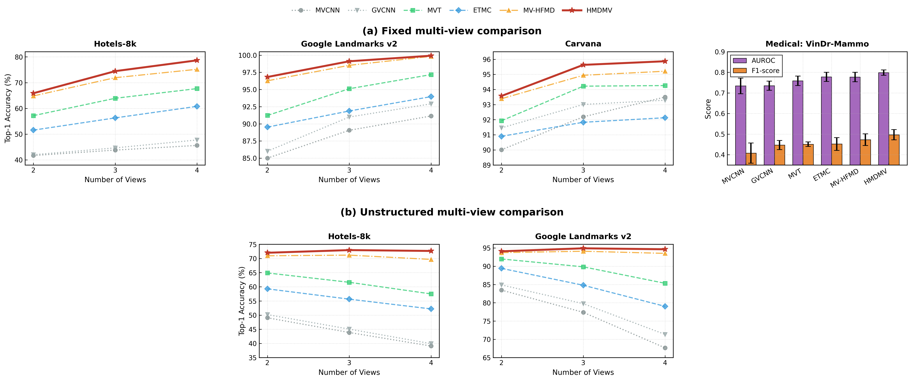

# HMDMV

Official PyTorch implementation of **HMDMV: Hierarchical Mutual Distillation for Multi-View Fusion**.

**Paper:** [Hierarchical mutual distillation for multi-view fusion: Learning from all possible view combinations](https://www.sciencedirect.com/science/article/pii/S0031320326003973)  
**Journal:** *Pattern Recognition*

## Overview

HMDMV is a multi-view fusion framework designed for both **structured** and **unstructured** multi-view image classification.  
Unlike conventional methods that rely only on single-view or full multi-view fusion, HMDMV learns from **all possible view combinations** and improves robustness under incomplete multi-view settings through **uncertainty-aware weighting** and **hierarchical mutual distillation**.

<p align="center">
  
</p>

HMDMV learns from:
- **Single-view**
- **Partial multi-view**
- **Full multi-view**

## Release Scope

This public release currently provides:
- the core implementation of **HMDMV**
- the training / validation / test pipeline
- the **Hotels-8k** split files used in our reference benchmark
- a runnable training script for the Hotels-8k setting

## Main Results Overview

The figure below summarizes the main experimental results of HMDMV across fixed and unstructured multi-view settings.

<p align="center">
  
</p>

For full quantitative comparisons and additional experiments, please refer to the paper.

## Repository Structure

```text
.
├── dataset/
│   └── hotels8k.py
├── figure/
│   ├── HMDMV_overview.png
│   └── results_overview.png
├── hotels8k/
│   ├── train.csv
│   ├── val.csv
│   └── test.csv
├── loss/
│   └── hmd_loss.py
├── networks/
│   └── hmdmv.py
├── process/
│   └── train.py
├── scripts/
│   └── run_hotels8k.sh
├── main.py
├── utils.py
├── requirements.txt
├── README.md
└── LICENSE
```

## Installation

```bash
pip install -r requirements.txt
```

## Dataset Preparation

This repository includes the **Hotels-8k** split CSV files only.  
Please prepare the original Hotels-8k images separately and make sure the paths in the CSV files match your local environment.

## Configuration

### Number of Views
The number of input views can be set with `--num_view`.

Supported values:
- `1`
- `2`
- `3`
- `4`

Example:
```bash
python main.py --num_view 3
```

### Backbone Models
The base model can be selected with `--model_name`.

Supported options in this release:
- `vit_tiny_r_s16_p8_224`
- `vit_small_r26_s32_224`
- `vit_base_r26_s32_224`
- `vit_base_r50_s16_224`

Example:
```bash
python main.py --model_name vit_small_r26_s32_224
```

## Training

Run the Hotels-8k reference experiment with:

```bash
bash scripts/run_hotels8k.sh
```

Or run directly:

```bash
python main.py \
    --dataset hotels8k \
    --num_view 3 \
    --num_classes 7774 \
    --method HMDMV \
    --model_name vit_small_r26_s32_224 \
    --hmd_loss True
```

## Citation

If you find this repository useful, please cite:

```bibtex
@article{yang2026hierarchical,
  title={Hierarchical Mutual Distillation for Multi-View Fusion: Learning from All Possible View Combinations},
  author={Yang, Jiwoong and Chung, Haejun and Jang, Ikbeom},
  journal={Pattern Recognition},
  pages={113432},
  year={2026},
  publisher={Elsevier}
}
```

## License

This project is released under the MIT License.
